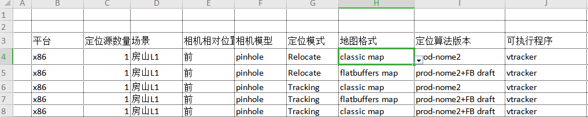
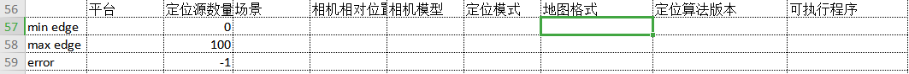

## kinds of test case 

to simple test progress, just divide test case into two kinds:
- basic test case : for total coverage in correct environment
- corner test case : for the ability to deal with the damage environment 

### basic test case 

#### list relation info 
- first : list the aim of test
- second : the correct target for test
- third : the variable in test 
- fourth : correct environment platform and resources

|test case ||
|-|-|
|aim| the correction of software |
|target| 1. precise|
||2.performance|
||3.function|
|variable| 1. platform|
||2.environment|
||3.device|
||4.mode|
|source|image, map, param|

#### change every variable into test case for coverage all environment

in excel, u can change each of the variable to make a different test case .
after all of the combination finished, u can get a total coverage test case.

### corner test case

- edge case
- error case

list all variable in excel, and expand its edge and error.

